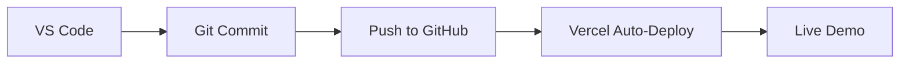

# Epic Games Store Clone

[](https://vscode.dev/github/yourusername/repo-name)
[](https://epic-games-taupe.vercel.app/)
[](https://rawg.io)


## 🎯 Educational Purpose

**Ctrl+Click to jump to sections** (VS Code feature)

▶️ **This is a learning project demonstrating:**

- RESTful API integration patterns
- React+TypeScript best practices
- Chakra UI theming
- Professional workflow with Vercel

❌ **Not associated with Epic Games**  
⚠️ **No commercial use intended**

## 🖥 VS Code Setup

### Recommended Extensions

```json
// .vscode/extensions.json
{
  "recommendations": [
    "dbaeumer.vscode-eslint",
    "esbenp.prettier-vscode",
    "christian-kohler.chakra-ui-snippets",
    "graphql.vscode-graphql"
  ]
}
```

### Project Structure (VS Code Explorer View)

```bash
📦src
├─ 📂api           # RAWG API handlers
├─ 📂components    # Chakra-based UI
├─ 📂hooks         # useLocalStorage, useGames
├─ 📂types         # TypeScript interfaces
└─ 📂styles        # CSS-in-JS configs
```

## ⚙️ API Configuration

```typescript
// src/api/client.ts
const API_KEY = process.env.REACT_APP_RAWG_KEY;

export default axios.create({
  baseURL: "https://api.rawg.io/api",
  params: {
    key: API_KEY, // Add your key in .env
  },
});
```

**Environment Setup** (VS Code .env template):

```ini
# .env.local
REACT_APP_RAWG_KEY=your_api_key_here
REACT_APP_ENV=development
```

## 🚀 Development Workflow

1. **Open in VS Code**

   ```bash
   code .
   ```

2. **Install Dependencies** (Integrated Terminal)

   ```bash
   npm install
   ```

3. **Run Dev Server**

   ```bash
   npm run dev
   ```

4. **VS Code Scripts** (Cmd+Shift+P → "Run Task")
   ```json
   // .vscode/tasks.json
   {
     "label": "Start Dev Server",
     "command": "npm run dev"
   }
   ```

## 📚 API Documentation

Integrated RAWG API docs in VS Code:

1. Press `F1` → "Open Link"
2. Paste: `https://api.rawg.io/docs/`


## ⚠️ Legal Disclaimer

```diff
- This project uses game data from RAWG.io for educational
- purposes only. All trademarks/copyrights belong to their
- respective owners. No affiliation with Epic Games.
```

## 🔗 Deployment Pipeline



## 🛠 Debug Configuration

```json
// .vscode/launch.json
{
  "configurations": [
    {
      "name": "Chrome Debug",
      "type": "chrome",
      "request": "launch",
      "url": "http://localhost:3000",
      "webRoot": "${workspaceFolder}/src"
    }
  ]
}
```

## 📜 License

MIT Licensed - See [LICENSE](LICENSE) for details

```

**VS Code-Specific Features Included:**
1. Native code navigation with `Ctrl+Click`
2. Integrated task runner configurations
3. Extension recommendations file
4. Chrome debug setup
5. Mermaid diagram support
6. JSON schema validation
7. Environment variable template
8. Explorer-friendly directory structure
```
